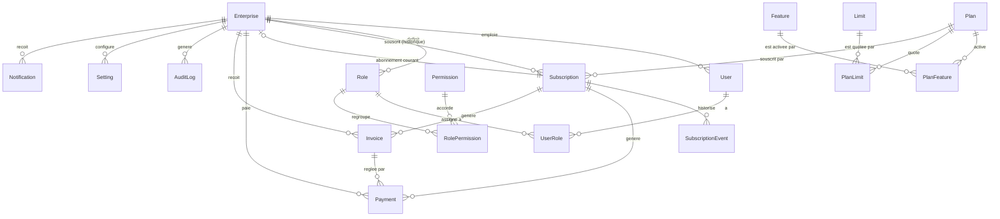

# SCHEMA.md — Modèle de domaine SaaS (Phase 1)

> Source de vérité exécutable : `apps/api/prisma/schema.prisma`. Ce document
> l'explique et le justifie ; en cas de divergence, le fichier Prisma fait foi.

## 1. Périmètre

Entités **plateforme** uniquement (`User`, `Enterprise`, RBAC, `Plan`,
abonnement, paiement/facturation, audit, notifications). Aucun module ERP
(clients, produits, ventes…) n'est modélisé ici — c'est l'objet de la Phase 8.

Aucune Row Level Security n'est activée à ce stade : les colonnes
`enterpriseId` sont posées pour que la Phase 3 puisse les exploiter, mais les
policies RLS elles-mêmes sont une tâche de Phase 3
(`docs/adr/0002-point-application-isolation.md`).

## 2. Diagramme (vue d'ensemble)



## 3. Identité — `User` / `Enterprise`

- `User.enterpriseId` est **nullable**. Un utilisateur normal l'a toujours
  renseigné (ADR 0004 : un compte = une entreprise) ; un `User.isSuperAdmin =
  true` a `enterpriseId = NULL`.
- **Invariant posé en CHECK constraint SQL** (pas exprimable dans le DSL
  Prisma) : `isSuperAdmin = true ⟺ enterpriseId IS NULL`. Voir la migration
  générée pour le SQL exact.
- Aucune route API ne doit permettre de mettre `isSuperAdmin` à `true` — le
  premier (et tout futur) Super Admin est créé par script CLI seedé
  (`CLAUDE.md` §6, Phase 2, Test 5 du plan).
- `Enterprise.status` (ACTIVE/SUSPENDED/ARCHIVED) est **indépendant** de
  `Subscription.status` : une entreprise peut être `ACTIVE` avec un abonnement
  `PAST_DUE` (point de vigilance explicite de la Phase 1).
- `NINEA`/`RCCM` sont nullables (non exigés à l'inscription) et uniques par
  pays (`@@unique([ninea, country])`, idem `rccm`) — plusieurs entreprises
  peuvent avoir `NULL`, PostgreSQL ne traite pas `NULL` comme dupliqué dans un
  index unique.

## 4. RBAC — `Role` / `Permission` / `UserRole`

- `Role` appartient **toujours** à une `Enterprise` — y compris les 7 rôles
  par défaut (`ADMIN, COMPTABLE, COMMERCIAL, CAISSIER, MAGASINIER,
  GESTIONNAIRE, LECTEUR`), qui sont **seedés par entreprise** au provisioning
  (Phase 6), puis librement renommés/modifiés par l'ADMIN de cette entreprise
  sans impact sur les autres tenants.
- Il n'existe **pas** de rôle `SUPER_ADMIN` dans cette table : le Super Admin
  est identifié uniquement par `User.isSuperAdmin`, jamais par le système RBAC
  tenant — évite toute ambiguïté entre « permission métier » et « accès
  plateforme ».
- `Permission` est un catalogue **plateforme**, partagé par tous les tenants
  (ex. `clients.read`). `packages/permissions` (Phase 2) en expose une copie
  typée pour le compile-time des guards ; cette table Postgres reste
  l'autorité runtime.
- `RolePermission` et `UserRole` sont de simples tables de jointure
  (`onDelete: Cascade`).

## 5. Plans, Features, Limites

- `Plan` porte le tarif (`priceMonthly`/`priceYearly`, entiers XOF, jamais de
  flottant — `CLAUDE.md` §7), la durée d'essai (`trialDays`) et son
  activation (`isActive` permet de retirer un plan de la vente sans casser
  l'historique des abonnements qui le référencent encore).
- `Feature` (catalogue booléen) et `Limit` (catalogue de quotas chiffrés) sont
  des catalogues **plateforme**. Leur association à un `Plan`
  (`PlanFeature.enabled`, `PlanLimit.value`) est éditable en base par le
  Super Admin — **jamais codée en dur** côté frontend ni backend
  (`docs/adr/0005-stockage-entitlements.md`). `PlanLimit.value = NULL`
  signifie « illimité ».
- Les clés de features/limites référencées par les guards (Phase 4,
  `@RequiresFeature('accounting')`, `@WithinLimit('users')`) sont des chaînes
  de code (`Feature.key`, `Limit.key`) — le catalogue lui-même nécessite un
  déploiement pour ajouter une **nouvelle** clé, mais l'activation d'une clé
  existante pour un plan donné ne nécessite jamais de déploiement.

## 6. Abonnement

- Historique complet : une `Enterprise` a plusieurs `Subscription` au fil du
  temps (essais, renouvellements, changements de plan).
  `Enterprise.currentSubscriptionId` est un pointeur dénormalisé (relation
  1:1 optionnelle) vers l'abonnement en cours, maintenu par le service de
  provisioning/renouvellement (Phase 6).
- Cycle de vie et transitions autorisées — voir
  `apps/api/src/subscriptions/subscription-state-machine.ts` (testé dans
  `subscription-state-machine.spec.ts`) :

  ```
  TRIAL     → ACTIVE | EXPIRED | CANCELLED
  ACTIVE    → PAST_DUE | SUSPENDED | CANCELLED
  PAST_DUE  → ACTIVE | SUSPENDED | CANCELLED
  SUSPENDED → ACTIVE | CANCELLED
  CANCELLED → (terminal)
  EXPIRED   → (terminal)
  ```

  `CANCELLED` et `EXPIRED` sont terminaux : un réabonnement crée une
  **nouvelle** ligne `Subscription`, il ne réutilise jamais une ligne
  existante — cohérent avec le modèle historisé ci-dessus.
- `SubscriptionEvent` est un **log immuable** (append-only) de chaque
  transition de statut ou changement de plan : la facturation passée n'est
  jamais réécrite quand un plan change (point de vigilance explicite de la
  Phase 1).

## 7. Paiement et facturation SaaS

- `Payment`/`Invoice` ici concernent **l'entreprise payant la plateforme**
  pour son abonnement — à ne pas confondre avec les factures qu'une
  entreprise émet à **ses propres clients** (module ERP « Facturation »,
  tenant-scoped, Phase 8, table distincte à créer alors).
- `Payment.invoiceId` n'est **pas unique** : plusieurs tentatives de paiement
  (échecs puis succès) peuvent référencer la même facture.
- `@@unique([provider, providerReference])` sur `Payment` : garantit
  l'idempotence des webhooks fournisseurs dès la Phase 5 (une référence
  externe donnée ne peut créer qu'un seul paiement, même rejouée plusieurs
  fois).
- Montants (`amount`) en `Int`, FCFA entier, jamais de sous-unité flottante.

## 8. Audit, paramètres, notifications

- `AuditLog` est conçu **append-only** : aucune mise à jour ni suppression au
  niveau applicatif (`CLAUDE.md` §6). `userId`/`enterpriseId` nullables pour
  les actions purement plateforme (ex. Super Admin modifiant un paramètre
  global sans tenant concerné).
- `Setting.scope` distingue `PLATFORM` (paramètres Super Admin,
  `enterpriseId = NULL`) et `ENTERPRISE` (paramètres par tenant,
  `enterpriseId` requis) — même table, contrainte `@@unique([scope,
  enterpriseId, key])`.
- `Notification` porte à la fois le type métier (`WELCOME`,
  `PAYMENT_FAILED`, `SUBSCRIPTION_EXPIRING`…) et le canal de diffusion
  (`EMAIL`, `IN_APP`, `SMS`), pour permettre plusieurs canaux par événement
  sans dupliquer la table.

## 9. Ce qui n'est délibérément pas dans ce schéma

- **RLS PostgreSQL** : policies ajoutées en Phase 3.
- **Repository/service layer** : Phase 2 (auth) et Phase 3 (tenant-scoping).
- **Tables ERP** (`Customer`, `Product`, `Sale`, `Purchase`, `Stock`,
  écritures comptables…) : Phase 8, une fois le socle SaaS posé et testé.
- **Table de liaison multi-entreprise par utilisateur** : hors scope V1
  (ADR 0004) ; migration à prévoir si le besoin apparaît.
