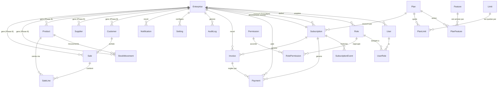

# SCHEMA.md — Modèle de domaine SaaS (Phase 1)

> Source de vérité exécutable : `apps/api/prisma/schema.prisma`. Ce document
> l'explique et le justifie ; en cas de divergence, le fichier Prisma fait foi.

## 1. Périmètre

Entités **plateforme** (`User`, `Enterprise`, RBAC, `Plan`, abonnement,
paiement/facturation, audit, notifications), complétées depuis la Phase 8 par
les entités **ERP** (tenant-scoped), module par module. `Customer` (§5bis),
`Supplier` (§5ter), `Product` (§5quater), `StockMovement` (§5quinquies) et
`Sale`/`SaleLine` (§5sexies) sont les cinq premiers modules ERP migrés ; les
autres (achats, facturation, comptabilité, rapports) suivent le même patron.

> Mise à jour Phase 3 (2026-08-09) : la Row Level Security est maintenant
> active sur les tables listées ci-dessous — voir
> `docs/adr/0008-deux-roles-postgres-identite-vs-tenant.md` et la migration
> `20260809113836_add_tenant_role_and_rls`. Le reste de ce document décrit le
> schéma de données (Phase 1) ; l'isolation elle-même est documentée dans
> l'ADR 0008 et `docs/PROMPT-MAITRE-SAAS.md` Phase 3.

## 2. Diagramme (vue d'ensemble)



## 3. Identité — `User` / `Enterprise`

- `User.enterpriseId` est **nullable**. Un utilisateur normal l'a toujours
  renseigné (ADR 0004 : un compte = une entreprise) ; un `User.isSuperAdmin =
  true` a `enterpriseId = NULL`.
- **Invariant posé en CHECK constraint SQL** (pas exprimable dans le DSL
  Prisma) : `isSuperAdmin = true ⟺ enterpriseId IS NULL`. Voir la migration
  générée pour le SQL exact.
- Aucune route API ne doit permettre de mettre `isSuperAdmin` à `true` — le
  premier (et tout futur) Super Admin est créé par script CLI seedé
  (`CLAUDE.md` §6, Phase 2, Test 5 du plan).
- `Enterprise.status` (ACTIVE/SUSPENDED/ARCHIVED) est **indépendant** de
  `Subscription.status` : une entreprise peut être `ACTIVE` avec un abonnement
  `PAST_DUE` (point de vigilance explicite de la Phase 1).
- `NINEA`/`RCCM` sont nullables (non exigés à l'inscription) et uniques par
  pays (`@@unique([ninea, country])`, idem `rccm`) — plusieurs entreprises
  peuvent avoir `NULL`, PostgreSQL ne traite pas `NULL` comme dupliqué dans un
  index unique.

## 4. RBAC — `Role` / `Permission` / `UserRole`

- `Role` appartient **toujours** à une `Enterprise` — y compris les 7 rôles
  par défaut (`ADMIN, COMPTABLE, COMMERCIAL, CAISSIER, MAGASINIER,
  GESTIONNAIRE, LECTEUR`), qui sont **seedés par entreprise** au provisioning
  (Phase 6), puis librement renommés/modifiés par l'ADMIN de cette entreprise
  sans impact sur les autres tenants.
- Il n'existe **pas** de rôle `SUPER_ADMIN` dans cette table : le Super Admin
  est identifié uniquement par `User.isSuperAdmin`, jamais par le système RBAC
  tenant — évite toute ambiguïté entre « permission métier » et « accès
  plateforme ».
- `Permission` est un catalogue **plateforme**, partagé par tous les tenants
  (ex. `clients.read`). `packages/permissions` (Phase 2) en expose une copie
  typée pour le compile-time des guards ; cette table Postgres reste
  l'autorité runtime.
- `RolePermission` et `UserRole` sont de simples tables de jointure
  (`onDelete: Cascade`).

## 5. Plans, Features, Limites

- `Plan` porte le tarif (`priceMonthly`/`priceYearly`, entiers XOF, jamais de
  flottant — `CLAUDE.md` §7), la durée d'essai (`trialDays`) et son
  activation (`isActive` permet de retirer un plan de la vente sans casser
  l'historique des abonnements qui le référencent encore).
- `Feature` (catalogue booléen) et `Limit` (catalogue de quotas chiffrés) sont
  des catalogues **plateforme**. Leur association à un `Plan`
  (`PlanFeature.enabled`, `PlanLimit.value`) est éditable en base par le
  Super Admin — **jamais codée en dur** côté frontend ni backend
  (`docs/adr/0005-stockage-entitlements.md`). `PlanLimit.value = NULL`
  signifie « illimité ».
- Les clés de features/limites référencées par les guards (Phase 4,
  `@RequiresFeature('accounting')`, `@WithinLimit('users')`) sont des chaînes
  de code (`Feature.key`, `Limit.key`) — le catalogue lui-même nécessite un
  déploiement pour ajouter une **nouvelle** clé, mais l'activation d'une clé
  existante pour un plan donné ne nécessite jamais de déploiement.

## 5bis. Module ERP — `Customer` (Phase 8)

- Premier modèle **tenant-scoped** hors socle plateforme : `enterpriseId`
  (indexé) + RLS forcée dès sa migration (`20260809235329_add_customer`),
  même patron que `Account` (Phase 6) — voir `CustomersRepository`
  (`apps/api/src/customers/`), seul point d'accès Prisma autorisé.
- Suppression **toujours logique** (`isActive=false`, jamais de `DELETE`
  physique) : les modules Ventes/Facturation à venir référenceront
  `customerId` en FK, une suppression physique casserait leur historique.
- `NINEA`/`RCCM` : format libre (pas de regex), contrairement à l'intention
  affichée dans `CLAUDE.md` §7 — aucune règle de format officielle n'est
  encore documentée dans le projet ; même choix que `Enterprise.ninea/rccm`
  (Phase 1). Pas d'unicité DB non plus (un même NINEA peut légitimement
  apparaître côté client d'un tenant et fournisseur d'un autre).
- Accès conditionné par une **feature de plan** booléenne (`Feature.key =
  "clients"`, activée sur les 4 forfaits au seed) en plus de la permission
  RBAC (`clients.read/create/update/delete`) — premier consommateur réel de
  `@RequiresFeature` (Phase 4, jusque-là seulement testé directement, jamais
  posé sur une route). Pas de quota chiffré (`Limit`) dans ce cycle.

## 5ter. Module ERP — `Supplier` (Phase 8, module 2)

Copie conforme de `Customer` (§5bis) — mêmes garanties structurelles (RLS
forcée, suppression toujours logique, `CustomerType` réutilisé sans
duplication). Deux écarts seulement par rapport au gabarit Clients :

- Permissions dédiées `suppliers.read/create/update/delete`, ajoutées au
  catalogue `packages/permissions` (absent depuis la Phase 2, contrairement à
  `clients.*` qui existait déjà) — décision : pas de réutilisation de
  `purchases.*`, qui mélangerait deux ressources distinctes.
- Trois nouvelles clés `AuditAction` (`CREATE_SUPPLIER`, `UPDATE_SUPPLIER`,
  `DELETE_SUPPLIER`) : contrairement à Clients qui avait pu réutiliser
  `DELETE_CLIENT` (déjà présente depuis la Phase 1), aucune clé fournisseur
  n'existait.

## 5quater. Module ERP — `Product` (Phase 8, module 3)

Contrairement à `Customer`/`Supplier` (des tiers), `Product` est un article de
catalogue — modèle de champs différent, pas une copie :

- `code` obligatoire, unique **par tenant** (`@@unique([enterpriseId, code])`)
  — premier modèle ERP avec une contrainte d'unicité métier ; mappée en 409
  (`ConflictException`) côté repository plutôt que de laisser fuiter l'erreur
  Prisma `P2002` brute, même patron que la gestion NINEA/RCCM du
  `ProvisioningService` (Phase 6).
- Prix stocké HT (`sellingPriceExcludingTax`, `Int`, XOF) + taux de TVA en
  points de base (`vatRateBasisPoints`, défaut 1800 = 18 %, `CLAUDE.md` §7) ;
  le TTC se calcule à l'affichage, jamais stocké — évite la dérive de données
  si le taux change après coup.
- `trackStock` (défaut `true`) distingue un produit physique (suivi de stock,
  module Stock à venir) d'un service non stocké — posé dès maintenant pour
  éviter une migration rétrospective sur tous les produits déjà créés.
- Pas de `purchasePrice` (coût d'achat) dans ce cycle : aucun module
  Achats/Stock n'existe encore pour l'utiliser.
- Aucun écart par rapport au gabarit Clients/Fournisseurs, contrairement au
  module Fournisseurs : les permissions `products.read/create/update/delete`
  (catalogue `packages/permissions`) et l'entrée de menu/route `/app/products`
  existaient déjà (posées par anticipation lors des Phases 2 et 7.2, comme
  `clients.*`) — seules deux nouvelles clés `AuditAction` ont dû être créées
  (`CREATE_PRODUCT`, `DELETE_PRODUCT`).

## 5quinquies. Module ERP — `StockMovement` (Phase 8, module 4)

Contrairement à `Customer`/`Supplier`/`Product` (des fiches), Stock n'est pas
une entité mais un **grand livre de mouvements** — écart structurant, pas une
copie du gabarit précédent :

- **Aucune quantité en stock stockée sur `Product`** : `StockMovement` est la
  seule source de vérité, la quantité couramment en stock se **calcule** par
  agrégation des mouvements (`groupBy` Prisma par `type`, sommes combinées en
  application) — même principe que le TTC produit (§5quater, « jamais de
  donnée dérivée stockée », `CLAUDE.md` §7).
- **Append-only**, comme `AuditLog` : aucune route `PATCH`/`DELETE` sur un
  mouvement ; une correction d'inventaire se fait via un nouveau mouvement
  `type = ADJUSTMENT`, jamais en réécrivant l'historique.
- `quantity` porte des règles différentes selon `type` (validées par
  `.refine()` dans `packages/validation/src/stock.ts`) : magnitude positive
  pour `IN`/`OUT` (le signe est porté par `type`, pas par la valeur — reste
  lisible dans l'historique) ; delta signé non nul pour `ADJUSTMENT`.
- **Garde stock jamais négatif**, à la création d'un mouvement : le
  repository calcule le solde courant puis le nouveau solde dans la **même**
  transaction, et rejette (409) si le résultat serait négatif. Cette
  transaction utilise l'isolation `Serializable` (et non `ReadCommitted`, le
  défaut des autres modules) — sous `ReadCommitted`, deux créations
  concurrentes sur le même produit pourraient toutes deux lire le même solde
  de départ et laisser passer un stock négatif ; Postgres fait alors échouer
  l'une des deux transactions en conflit (erreur `40001` / Prisma `P2034`),
  rattrapée en 409 par `StockRepository`. Voir
  `apps/api/src/tenant/tenant-scoped-prisma.service.ts` (`run()` accepte
  désormais un `isolationLevel` optionnel, rétrocompatible pour tous les
  autres appelants).
- Pas de `userId` sur le modèle : `AuditLog` (action `CREATE_STOCK_MOVEMENT`)
  trace déjà l'auteur, inutile de le dupliquer.
- Pas de `warehouseId`/notion d'entrepôt dans ce cycle : un seul stock
  implicite par entreprise, aucun besoin multi-entrepôt exprimé (`CLAUDE.md`
  §9) — à ajouter par migration si nécessaire plus tard.
- Aucun écart de permissions/route : `stock.read/create/update/delete`
  (`packages/permissions`) et l'entrée de menu `/app/stock` existaient déjà
  (anticipées Phases 2/7.2). `stock.update`/`stock.delete` restent non
  consommées par ce module (cohérent avec l'absence de routes
  update/delete). Une seule nouvelle clé `AuditAction`
  (`CREATE_STOCK_MOVEMENT`).

## 5sexies. Module ERP — `Sale` / `SaleLine` (Phase 8, module 5)

Première entité ERP **à lignes** — écart structurant, pas une copie du
gabarit précédent. `Sale` n'est **pas** une facture : la Facturation (module
ultérieur, distinct) transformera une vente confirmée en document légal ;
son schéma n'est pas anticipé ici.

- Cycle de vie volontairement minimal : `DRAFT -> CONFIRMED | CANCELLED`.
  `CONFIRMED` est **terminal** dans ce cycle — pas de retour en arrière qui
  réajusterait le stock déjà sorti ; une correction après confirmation
  passera par un futur avoir/retour, hors scope. `CANCELLED` n'est
  atteignable que depuis `DRAFT` (aucun impact stock à annuler).
- **Lignes immuables, pas de PATCH** : `unitPriceExcludingTax` et
  `vatRateBasisPoints` sur `SaleLine` sont un **instantané résolu côté
  serveur** depuis `Product` au moment de la création — jamais transmis par
  le client (`CLAUDE.md` §6, ne jamais faire confiance à une valeur
  monétaire venue du client). Le prix catalogue peut changer ensuite sans
  altérer l'historique des ventes déjà créées. Pas de remise/prix
  personnalisé dans ce cycle. Une vente erronée se corrige en l'annulant
  puis en recréant, pas en réécrivant ses lignes.
- **Aucun total stocké** : `totalExcludingTax`/`totalVat`/`totalIncludingTax`
  sont calculés à la lecture à partir des lignes (elles-mêmes figées), même
  principe que la quantité en stock (§5quinquies) et le TTC produit
  (§5quater) — jamais de donnée dérivée stockée.
- **Confirmation = décrémentation de stock composée, pas dupliquée** :
  `SalesRepository.confirm()` réutilise `StockRepository.applyMovement()`
  (méthode extraite du module Stock, voir §5quinquies) pour chaque ligne
  `trackStock=true`, **dans la même transaction `Serializable`** que le
  passage à `CONFIRMED` — vente confirmée et stock décrémenté réussissent ou
  échouent ensemble. Rejette (409) si une ligne dépasse le stock disponible.
- `enterpriseId` dupliqué sur `SaleLine` (comme sur `StockMovement`) : une
  policy RLS ne traverse pas une relation, chaque table tenant a besoin de
  sa propre colonne.
- Aucun écart de permissions/feature : `sales.read/create/update/delete`
  existaient déjà. `confirm`/`cancel` sont mappées sur
  `sales.update`/`sales.delete` (pas de nouvelles routes PATCH/DELETE au
  sens strict — même patron que la désactivation logique de `Product` mappée
  sur `products.delete`). Trois nouvelles clés `AuditAction`
  (`CREATE_SALE`, `CONFIRM_SALE`, `CANCEL_SALE`).

## 6. Abonnement

- Historique complet : une `Enterprise` a plusieurs `Subscription` au fil du
  temps (essais, renouvellements, changements de plan).
  `Enterprise.currentSubscriptionId` est un pointeur dénormalisé (relation
  1:1 optionnelle) vers l'abonnement en cours, maintenu par le service de
  provisioning/renouvellement (Phase 6).
- Cycle de vie et transitions autorisées — voir
  `apps/api/src/subscriptions/subscription-state-machine.ts` (testé dans
  `subscription-state-machine.spec.ts`) :

  ```
  TRIAL     → ACTIVE | EXPIRED | CANCELLED
  ACTIVE    → PAST_DUE | SUSPENDED | CANCELLED
  PAST_DUE  → ACTIVE | SUSPENDED | CANCELLED
  SUSPENDED → ACTIVE | CANCELLED
  CANCELLED → (terminal)
  EXPIRED   → (terminal)
  ```

  `CANCELLED` et `EXPIRED` sont terminaux : un réabonnement crée une
  **nouvelle** ligne `Subscription`, il ne réutilise jamais une ligne
  existante — cohérent avec le modèle historisé ci-dessus.
- `SubscriptionEvent` est un **log immuable** (append-only) de chaque
  transition de statut ou changement de plan : la facturation passée n'est
  jamais réécrite quand un plan change (point de vigilance explicite de la
  Phase 1).

## 7. Paiement et facturation SaaS

- `Payment`/`Invoice` ici concernent **l'entreprise payant la plateforme**
  pour son abonnement — à ne pas confondre avec les factures qu'une
  entreprise émet à **ses propres clients** (module ERP « Facturation »,
  tenant-scoped, Phase 8, table distincte à créer alors).
- `Payment.invoiceId` n'est **pas unique** : plusieurs tentatives de paiement
  (échecs puis succès) peuvent référencer la même facture.
- `@@unique([provider, providerReference])` sur `Payment` : garantit
  l'idempotence des webhooks fournisseurs dès la Phase 5 (une référence
  externe donnée ne peut créer qu'un seul paiement, même rejouée plusieurs
  fois).
- Montants (`amount`) en `Int`, FCFA entier, jamais de sous-unité flottante.

## 8. Audit, paramètres, notifications

- `AuditLog` est conçu **append-only** : aucune mise à jour ni suppression au
  niveau applicatif (`CLAUDE.md` §6). `userId`/`enterpriseId` nullables pour
  les actions purement plateforme (ex. Super Admin modifiant un paramètre
  global sans tenant concerné).
- `Setting.scope` distingue `PLATFORM` (paramètres Super Admin,
  `enterpriseId = NULL`) et `ENTERPRISE` (paramètres par tenant,
  `enterpriseId` requis) — même table, contrainte `@@unique([scope,
  enterpriseId, key])`.
- `Notification` porte à la fois le type métier (`WELCOME`,
  `PAYMENT_FAILED`, `SUBSCRIPTION_EXPIRING`…) et le canal de diffusion
  (`EMAIL`, `IN_APP`, `SMS`), pour permettre plusieurs canaux par événement
  sans dupliquer la table.

## 9. Ce qui n'est délibérément pas dans ce schéma

- **RLS PostgreSQL** : active depuis la Phase 3 sur `enterprises`, `roles`,
  `user_roles`, `role_permissions`, `users`, `settings`, `notifications`,
  `subscriptions`, `subscription_events`, `payments`, `invoices`, `accounts`,
  et depuis la Phase 8 sur `customers`, `suppliers`, `products`,
  `stock_movements`, `sales` et `sale_lines` — voir
  `docs/adr/0008-deux-roles-postgres-identite-vs-tenant.md`.
  `refresh_tokens`/`auth_tokens` en restent exclus (pas de colonne
  `enterpriseId`, isolation par unicité du hash) ; `audit_logs` aussi, tant
  qu'aucune lecture scopée tenant n'existe (même ADR).
- **Tables ERP restantes** (`Purchase`, écritures comptables…) : reste de la
  Phase 8, module par module —
  `Customer`/`Supplier`/`Product`/`StockMovement`/`Sale`
  (§5bis/§5ter/§5quater/§5quinquies/§5sexies) servent de patron :
  tenant-scoped (`enterpriseId` + RLS) dès l'introduction de chaque nouveau
  modèle.
- **Table de liaison multi-entreprise par utilisateur** : hors scope V1
  (ADR 0004) ; migration à prévoir si le besoin apparaît.
